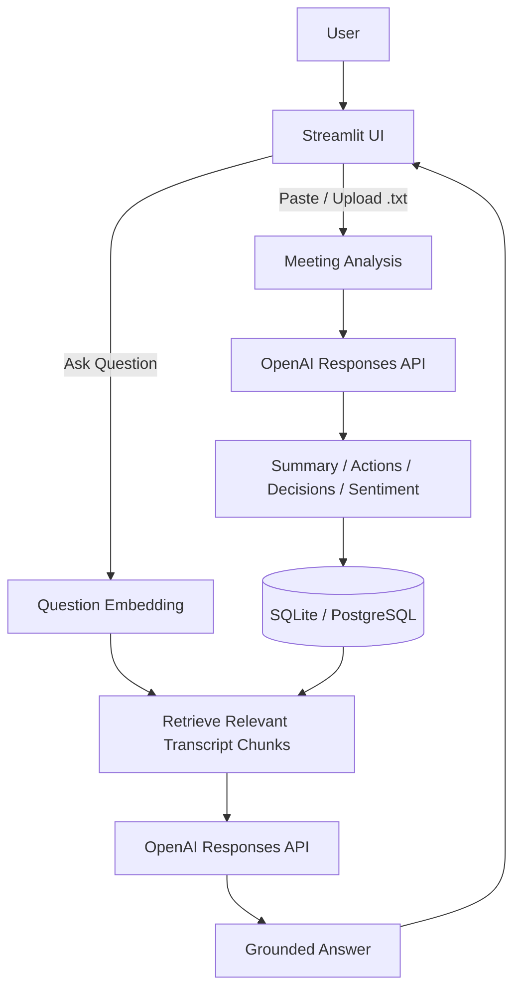
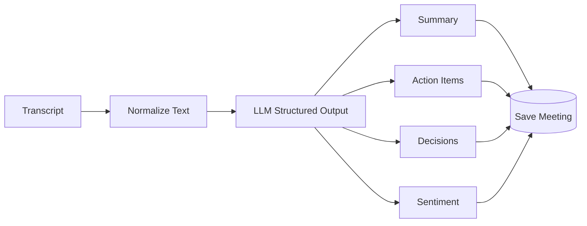
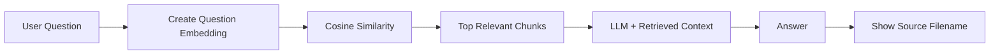

# Smart Meeting Notes Assistant

A lightweight Streamlit application that converts meeting transcripts into structured notes and lets users ask follow-up questions about saved meetings.

## Features

- Paste a meeting transcript or upload a `.txt` file
- Generate 3-5 summary points
- Extract action items with owner and due date when mentioned
- Extract key decisions
- Generate meeting sentiment / tone
- Ask follow-up questions about the selected meeting
- Save and reopen previous meetings
- Preserve chat history
- Show the uploaded `.txt` filename as the answer source

> Audio upload is not included because it is an optional stretch goal in the assignment.

---

## Application Design



### Meeting Analysis Flow



### Follow-up Q&A Flow



---

## Technical Stack

| Layer | Technology |
|---|---|
| Language | Python |
| UI / Application | Streamlit |
| LLM | OpenAI Responses API |
| Structured Output | JSON Schema |
| Embeddings | `text-embedding-3-small` |
| Retrieval | Python cosine similarity |
| Database Access | SQLAlchemy |
| Local Database | SQLite |
| Deployed Database | PostgreSQL / Neon |
| Testing | pytest |
| Deployment | Streamlit Community Cloud |

---

## Project Structure

```text
smart-meeting-notes-assistant/
├── streamlit_app.py
├── services/
│   ├── db.py
│   ├── llm_service.py
│   └── text_utils.py
├── sample_data/
│   └── sample_meeting.txt
├── tests/
├── requirements.txt
├── .env.example
└── README.md
```

---

## Local Setup

### 1. Create a virtual environment

```bash
python3 -m venv .venv
source .venv/bin/activate
```

Windows:

```bash
python -m venv .venv
.venv\Scripts\activate
```

### 2. Install dependencies

```bash
pip install -r requirements.txt
```

### 3. Create `.env`

Copy `.env.example` to `.env` and add your values:

```env
OPENAI_API_KEY=your_openai_api_key
OPENAI_MODEL=gpt-5-mini
OPENAI_EMBEDDING_MODEL=text-embedding-3-small
DATABASE_URL=
```

Leave `DATABASE_URL` empty for local development. The app will use SQLite.

Do not commit `.env` to GitHub.

### 4. Run the application

```bash
streamlit run streamlit_app.py
```

Open:

```text
http://localhost:8501
```

---

## How to Use

1. Enter a meeting title.
2. Paste a transcript or upload a `.txt` file.
3. Click **Analyze & save meeting**.
4. Review:
   - Summary
   - Sentiment
   - Action items
   - Key decisions
5. Ask follow-up questions such as:
   - `What decisions were made?`
   - `Who owns the deployment task?`
   - `When is the action item due?`
6. Reopen saved meetings from the sidebar.

For uploaded files, answers display the original filename as the source.

Example:

```text
Mike owns the deployment checklist and it is due Friday.

Source: sprint_review.txt
```

---

## Deployment

### Database

- Local: SQLite
- Streamlit deployment: PostgreSQL / Neon

### Streamlit Secrets

Add these values in Streamlit Community Cloud:

```toml
OPENAI_API_KEY = "your-openai-api-key"
OPENAI_MODEL = "gpt-5-mini"
OPENAI_EMBEDDING_MODEL = "text-embedding-3-small"
DATABASE_URL = "postgresql://..."
```

Deploy `streamlit_app.py` from the GitHub repository. Streamlit will provide a public URL that can be shared with the assignment reviewer.

---

## Run Tests

```bash
pytest -q
```
